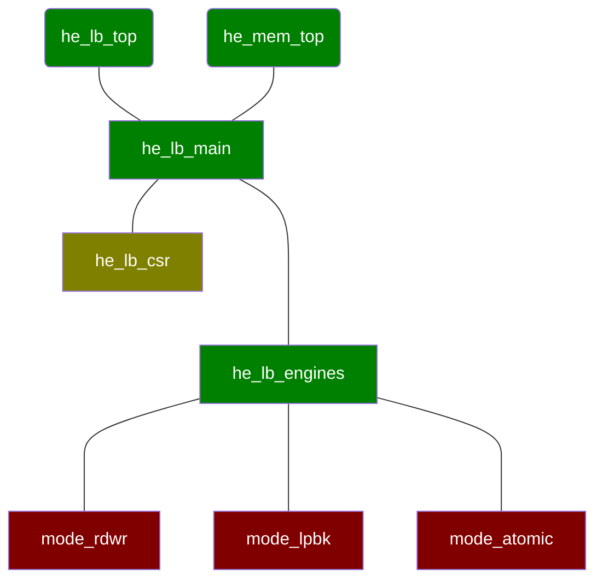

# Host Exerciser Loopback (HE LB)

The Host Exerciser Loopback AFU is a traffic generator that can be attached both to host memory, often over PCIe, and to local memory, such as board-attached DDR. It can test the correctness and throughput of memory channels.

On most default FIM configurations, an instance of HE LB attached to host memory is instantiated in the static region and an instance of HE LB attached to both host and local memory is instantiated in the partial reconfiguration region.

The choice of "loopback" in the name of this exerciser is historical and somewhat confusing. The exerciser has two primary modes: loopback, in which read data is fed back as writes, and read/write mode, in which reads and writes are generated independently. Furthermore, the [host\_exerciser](https://github.com/OPAE/opae-sdk/tree/master/samples/host_exerciser) software provided with OPAE that drives the RTL has two major modes: "lpbk" and "mem". These modes only select the UUID of the HE AFU, with lpbk selecting a version configured with no local memory \(56e203e9-864f-49a7-b94b-12284c31e02b\) and mem seeking a version with local memory \(8568ab4e-6ba5-4616-bb65-2a578330a8eb\). The behavior of each engine with and without local memory is described below.

The module topology is:



## Top-Level Modules

The exerciser is instantiated either with [he\_lb\_top.sv](he_lb_top.sv) for host memory or [he\_mem\_top.sv](he_mem_top.sv) for paths through both local and host memory. The host memory version takes a PCIe TLP interface and the HE MEM takes both a PCIe TLP interface and an interface to one bank of local memory.

* HE LB creates a dummy local memory interface in order to instantiate the common [he\_lb\_main.sv](he_lb_main.sv).
* HE MEM maps the incoming memory bank, which has a FIM-specific interface, into the Platform Interface Manager's \(PIM\) generic AXI-MM interface and passes it to [he\_lb\_main.sv](he_lb_main.sv), which is shared with the HE LB variant. Because the PIM-provided shim to map local memory is specific to the board, a single version of [he\_mem\_top.sv](he_mem_top.sv) supports all platforms. Preprocessor macros are used to select the proper FIM interface for reference platforms, such as choosing between an incoming Avalon or AXI-MM FIM connection to local memory.
* Platforms with multiple memory types or other complications could still use HE MEM by mapping a memory bank to the PIM's AXI-MM interface and connecting directly to [he\_lb\_main.sv](he_lb_main.sv) without using the provided top-level modules.

## Main

[he\_lb\_main.sv](he_lb_main.sv) converts the incoming streaming PCIe TLP interface to an AXI-MM interface. Like the local memory interface conversion in [he\_mem\_top.sv](he_mem_top.sv), Platform Interface Manager shims are instantiated to map PCIe TLP to the PIM's generic AXI-MM interface. The CSR manager is connected to an AXI-Lite interface, which is either provided directly by the PCIe Subsystem or by the PIM, depending on the platform.

With all the FIM interfaces now mapped to platform-independent abstractions, the main module instantiates [he\_lb\_engines.sv](he_lb_engines.sv). No modules below this point see bus-specific protocols, such as PCIe TLP. All interfaces are AXI-MM.

## Engine Wrapper

Inside the engine wrapper, the incoming AXI-MM host memory interface is multiplexed into separate interfaces for each of the engines: one for read/write, one for loopback, one for atomic tests and one for use by the wrapper itself. Only one engine may be active at a time, making arbitration simple. Only one engine at a time is active through the multiplexer.

A similar multiplexer is applied to the local memory port. Because both host and local memory use identical PIM-provided AXI-MM interfaces, the same module can be used to multiplex either host or local memory.

The engine wrapper instantiates modules that implement the test modes. It also manages which mode is active, controlled by a CSR structure driven by [he\_lb\_csr.sv](he_lb_csr.sv). When a test completes, the engine wrapper writes the final completion to the status buffer and, if configured, triggers an interrupt.

## Read/Write Mode

[mode\_rdwr.sv](mode_rdwr.sv) generates read and/or write streams that are independent of each other. The burst size of requests is configurable with CSRs. This engine is activated by modes "read", "write" and "trput" in host\_excerciser. This engine is generally the best choice for benchmarking.

When configured without local memory \(EMIF=0\), the read/write module accesses only host memory. When local memory is enabled \(EMIF=1\), the read/write module is connected only to local memory. This decision is handled by the engine wrapper. Since host and local memory have the same PIM AXI-MM interface, the [mode\_rdwr.sv](mode_rdwr.sv) RTL can drive either one. The only conditional logic in the read/write module that is driven by the EMIF parameter is the code that picks the source and destination buffer base addresses, since host buffer addresses make no sense for local memory.

The read/write module is either configured for a fixed number of transactions or in "continuous" mode. Continuous mode ends when a stop command is received through a CSR.

## Loopback Mode

Without local memory \(EMIF=0\), [mode\_lpbk.sv](mode_lpbk.sv) reads from the host memory source buffer and forwards read responses directly to the host memory write buffer. Reads and writes are generated in parallel once read responses begin to arrive. When local memory is available \(EMIF=1\) a more complicated path is used: read host memory, forward read responses to local memory, read from local memory and forward responses to host memory. Local memory AXI-MM write commit B channel responses drive the downstream read back from local memory.

Like read/write mode, the test ends either when a fixed number of transactions complete or when the stop command is received. Bit 0 of AXI-MM IDs is used to indicate the final request. At test end, bit 0 is set in the initial host memory read request. That bit is propagated through all downstream requests, finally arriving in the B channel host memory write commit. Once received on the B channel, the test signals that it is done.

## Atomic Mode

The PIM's AXI-MM interface includes atomic transaction fields from the AMBA 5 specification. The standard PCIe atomic transactions can be encoded, with atomic write requests resulting in updates of host memory and AXI-MM read responses returning the original memory contents. The atomic engine behaves much like the loopback engine, though local memory is never used. Atomic transactions are performed on the source buffer and their read responses are written back to the destination buffer.

The [mode\_atomic.sv](mode_atomic.sv) module includes functions for properly aligning data on the bus, including handling payload ordering for compare-and-swap.

## Host Exerciser Software

Software to drive the RTL is included in the OPAE SDK in [samples/host\_exerciser](https://github.com/OPAE/opae-sdk/tree/master/samples/host_exerciser). It is installed by default with OPAE. Use

```bash
host_exerciser --help
```

for details. To run a standard collection of tests, use one of:

```bash
host_exerciser --testall true lpbk
host_exerciser --testall true mem
```

The "mem" version looks for an AFU with the UUID indicating a connection to local memory. Throughput tests of the local memory version are often slower, since a single bank of DDR has significantly lower bandwidth than recent PCIe generations.