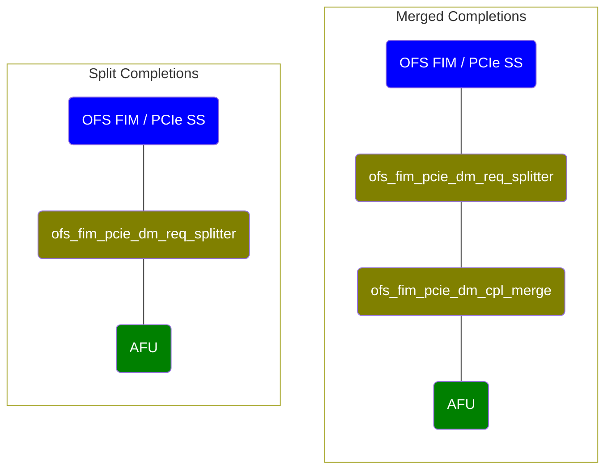

# Large Request Splitter/Merger

The PCIe Subsystem's Data Mover encoding supports very large read and write request sizes. Allowing a single AFU to generate very large requests presents a QoS problem when multiple AFUs are multiplexed, sharing a PCIe interface. The request splitter/merger allows any AFU to generate large requests, but splits the requests into a configurable maximum size. The smaller packets can then be multiplexed with similarly sized packets from other AFUs that share the same external device.

Completion reordering must be enabled in the PCIe SS when read requests will be split. There is not enough information in the split packets to restore their start addresses without completion sorting.

Large requests are split by instantiating [ofs\_fim\_pcie\_dm_req\_splitter.sv](ofs_fim_pcie_dm_req_splitter.sv) in the path between read and write requests and completions. The interface and behavior are described in the comment at the top of the file. Note that large read requests will be split into multiple reads, all sharing the same tag. It is assumed that the request splitter is instantiated upstream of the FIM's tag mapper, which will apply unique tags before the requests reach the PCIe SS.

An AFU may choose either to consume split read completions or it may instantiate [ofs\_fim\_pcie_dm\_cpl\_merge.sv](ofs_fim_pcie_dm_cpl_merge.sv), which recombines the split completions into a single packet with the same size as the original request. Since completion reordering is required, split completions arrive in order. An AFU that accepts split completions will see an initial completion corresponding to the start address of the original request. The start address of subsequent split completions can be computed from the lengths of each packet. Only the final split packet has the FC (final completion) bit set.

AFUs may define either of the following topologies. With just ofs\_fim\_pcie\_dm\_req\_splitter, both read and write requests are split into smaller chunks. Read responses will still be returned in order, but there may be multiple headers in the stream for a single AFU read request. With both the splitter and ofs\_fim\_pcie\_dm\_cpl\_merge instantiated, there will be a single completion header returned to the AFU for each original AFU read request.

The FIM generates local write commit messages as writes are passed to the PCIe Subsystem so that AFUs can track the merge point of the TX-A and TX-B streams. When writes are split, only one write commit is expected by the AFU. The FIM must generate a commit for only the final write in a split packet. A TUSER flag is employed, with the expectation that the write commit generation logic will detect the flag on split write requests and suppress local commit messages. The top-level splitter module has a parameter TUSER\_SUPPRESS\_COMMIT\_MSG to set the TUSER bit index. The FIM is responsible for ensuring that the flag's value matches the implementation of the local commit generator.
